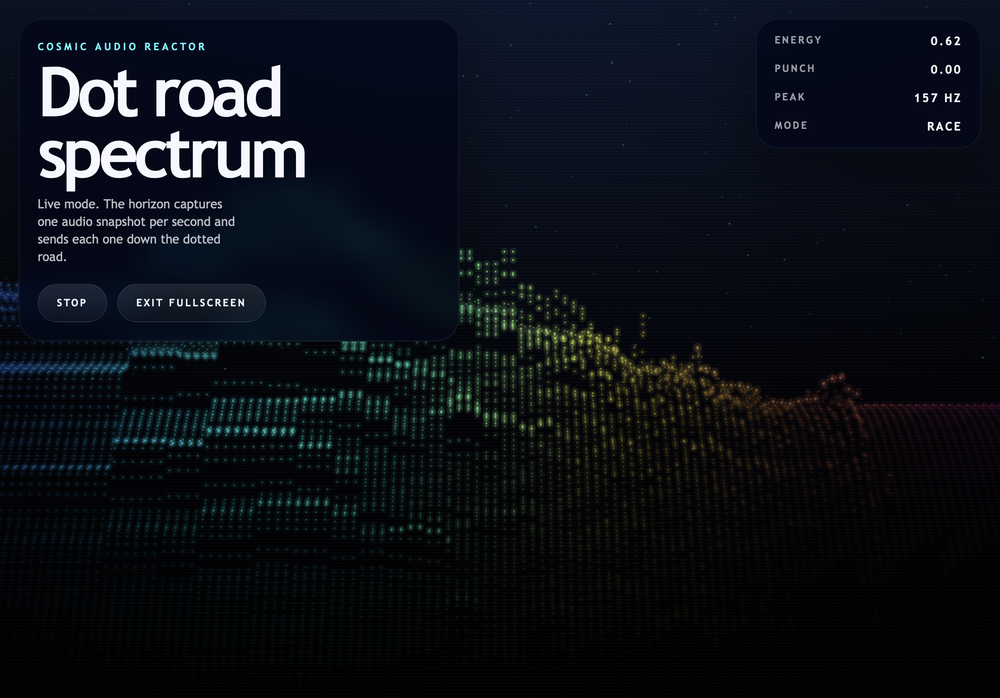

# VIZ421



VIZ421 is a single-file Chrome music visualizer that turns live microphone input into a retro-futuristic dotted rainbow road. Each audio snapshot is captured at the horizon and then travels toward the viewer like a stylized arcade racing scene.

## What It Does

This project renders a TRON-meets-Rad-Racer visualizer using only native browser APIs.

- Every visible element is made from small glowing dots
- Color is mapped strictly from left to right across the screen
- The horizon acts as the live audio source
- Each sampled spectrum row is frozen, then moves forward through a perspective field
- Idle mode still animates with synthetic horizon snapshots when the mic is off

## Current Visual Direction

- Flat dotted retro road / perspective field
- Pure black and deep blue space backdrop
- Neon rainbow horizon source
- Small ASMR-like particles with subtle glow
- Chrome-friendly microphone-driven playback

## Tech

- HTML5
- CSS3
- JavaScript
- Canvas 2D API
- Web Audio API

## Run Locally

Microphone access is unreliable on `file://`, so run the page from a local server.

### Simple Python server

```bash
python3 -m http.server 8080
```

Open:

```text
http://localhost:8080
```

### Live reload during development

```bash
npx live-server --port=8080
```

## How To Use

1. Open the app in Chrome or another modern browser
2. Click `Start mic`
3. Allow microphone access
4. Speak or play audio near the microphone
5. Use the same button again to stop the mic
6. Use `Fullscreen` for the cleanest presentation

The control overlay auto-hides after mic start and reappears when you move the mouse.

## Project Structure

```text
.
├── index.html
├── README.md
├── AGENTS.md
└── tasks/
    ├── todo.md
    └── lessons.md
```

## Notes

- The entire app lives in `index.html`
- No external dependencies, no CDN assets, no frameworks
- Snapshot cadence, perspective, glow, and color behavior are easy to tweak from the config block in `index.html`
- The visualizer is currently tuned around Chrome behavior first

## Production Notes

- Host over `http://localhost` in development and HTTPS in production for reliable mic permissions
- Keep the file single-page and lightweight unless there is a strong reason to split it
- If visual changes drift away from the road/snapshot concept, re-check the horizon sampling model before adding more effects

## License

Add your preferred license here.
